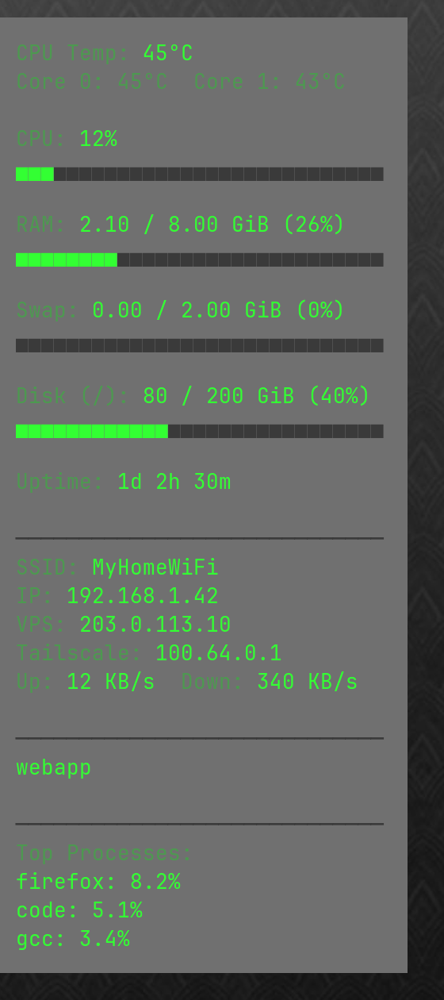

# sway-desktop-stats

Conky-style desktop stats widget for Sway/wlroots — that actually stays behind your windows.

[](https://github.com/Luquas95/sway-desktop-stats/releases)
[](https://swaywm.org/)
[](https://www.gnu.org/software/bash/)
[](https://opensource.org/license/MIT)
[](https://github.com/Luquas95/sway-desktop-stats)



## Why this exists

Conky renders through XWayland, and under a wlroots compositor an XWayland
floating window always draws *above* native Wayland toplevels, no matter
what window rules you throw at it. This project sidesteps the problem
entirely: it's a **second waybar instance** running as a
[wlr-layer-shell](https://wayland.app/protocols/wlr-layer-shell-unstable-v1)
surface on the `bottom` layer, which the Wayland protocol itself guarantees
stays under every normal application window.

The underlying trick isn't Sway-specific (any wlr-layer-shell compositor
works), but the install wiring in this repo targets Sway — originally built
under Omarchy/Hyprland, ported over after moving to plain Arch + Sway.

## What it shows

- **CPU temperature** — package/overall + per-core (Intel `coretemp`, AMD `k10temp`/`zenpower`, or a thermal-zone fallback)
- **CPU / RAM / Swap / Disk** — usage with color-coded bars (green / orange / red by load)
- **Uptime**
- **Wi-Fi** — SSID, local IP, public IP, Tailscale IP, live ↑/↓ throughput
- **Docker** — currently running containers
- **Top processes** — 3 most CPU-hungry processes on the system

All panels update every second. Every data source above is optional and
degrades gracefully — if you don't have Docker, Tailscale, a Wi-Fi card, or
a supported temperature sensor, that row is hidden or shown with a clear
fallback instead of breaking the panel.

## Requirements

- Sway (or another wlroots/wlr-layer-shell compositor — only the install
  wiring below assumes Sway specifically)
- **waybar** (required — this *is* a waybar instance)

Everything else is optional; missing tools just mean that row shows a
fallback instead of real data:

| Tool | Used for |
|---|---|
| `docker` | running containers list |
| `tailscale` | Tailscale IP row |
| `curl` | public IP ("VPS" row) |
| `iwctl` (iwd) or `nmcli` (NetworkManager) | Wi-Fi SSID |
| Intel `coretemp` / AMD `k10temp` / `zenpower` hwmon driver | CPU temperature |

## Installation

```bash
git clone https://github.com/Luquas95/sway-desktop-stats.git
cd sway-desktop-stats
./install.sh
```

This copies the panel files into `~/.config/waybar/`, installs
`sway/desktop-stats-widget.sh` to `~/.config/sway/scripts/` and adds an
`exec` line for it to `~/.config/sway/config` (only if one isn't already
there), and starts the panel immediately so you don't need to reload.

The guard script exists because, unlike Hyprland's `exec-once`, Sway
re-runs every plain `exec` line on `sway reload` — without a
`pgrep`-based guard you'd get a second (then third, then fourth...) waybar
instance stacking up every time you reload the config. Keep the guard in
its own script file rather than inlining it in the `exec` command: inlined,
`pgrep -f` would match the wrapping `sh -c` process's own command line
(which contains the same waybar command text as a fallback) and always
think the widget is already running, even when it isn't.

The shipped `desktop-stats.jsonc` targets outputs named `eDP-1` and
`HDMI-A-2` (this author's laptop + external monitor, switched between
depending on the day). Check your own output names with
`swaymsg -t get_outputs` and adjust the `"output"` fields — an output
block for a monitor that isn't currently connected is simply skipped by
waybar, so it's fine to leave a block in for a monitor you only use
sometimes.

To remove it again:

```bash
./uninstall.sh
```

## Configure

Copy the example config and edit it:

```bash
cp ~/.config/waybar/desktop-stats.conf.example ~/.config/waybar/desktop-stats.conf
```

| Setting | Default | Meaning |
|---|---|---|
| `WARN_THRESHOLD` / `CRIT_THRESHOLD` | `60` / `85` | percent thresholds where a bar turns orange / red |
| `COLOR_OK` / `COLOR_WARN` / `COLOR_CRIT` / `COLOR_LABEL` / `COLOR_DIM` | green/orange/red/dim-green/gray | bar and text colors |
| `DISK_PATH` | `/` | filesystem path the "Disk" row reports on |
| `NET_IFACE` | auto (default route) | force a specific network interface |
| `PUBLIC_IP_TTL` | `300` | seconds between public-IP lookups |
| `PUBLIC_IP_URL` | `https://icanhazip.com` | service used for the public-IP lookup |

To change position, size, or opacity, edit `desktop-stats.jsonc` (layer
margin) and `desktop-stats.css` (font size, padding, colors) directly in
`~/.config/waybar/`.

### If you change your wallpaper

The shipped `desktop-stats.css` doesn't use real transparency
(`background: transparent` / `rgba(...)`) — on some GPUs (older Intel
iGPUs in particular, e.g. Haswell/i915) the Wayland compositor never
composites a transparent or semi-transparent `wlr-layer-shell` surface
against what's actually behind it; it just renders solid black,
permanently, not only on startup or as a flash. So instead `window#waybar`
and `#custom-sysstats` in `desktop-stats.css` are solid colors
*precomputed* to look like the correct blend over one specific wallpaper.

That means **the colors are pinned to whatever wallpaper you had when
you set them up** — switching wallpapers won't make the panel
transparent again, it'll just look like a solid box that no longer
matches the background behind it. To re-tune it for a new wallpaper:

1. Sample the wallpaper's color at roughly the spot the panel sits
   (top-right corner by default; adjust the crop offset to match your
   own `margin` in `desktop-stats.jsonc`):
   ```bash
   magick ~/Pictures/your-wallpaper.jpg \
     -crop 400x400+1500+0 -resize 1x1 txt:-
   ```
2. Recompute the blend (this repo currently uses `rgba(170,170,170,0.45)`,
   a lighter gray at 45% opacity, over the sampled color):
   ```bash
   python3 -c "
   r, g, b = 65, 65, 65  # replace with the sampled rgb
   a = 0.45
   base = 170
   print(f'rgb({a*base+(1-a)*r:.0f},{a*base+(1-a)*g:.0f},{a*base+(1-a)*b:.0f})')
   "
   ```
3. Put that result in `#custom-sysstats { background: ... }`, and put
   the *raw sampled* wallpaper color (from step 1) in
   `window#waybar { background: ... }` — that one isn't blended, it's
   there to make the panel's outer edge (and its square corners —
   `border-radius` is 0 for the same reason) match the wallpaper it
   sits on. The rounded-corner cutout on a `transparent` layer-shell
   window is where the broken compositing shows up worst (a black
   "notch" instead of wallpaper), which is why the corners are square
   and the background is a flat sampled color instead of `transparent`.

If your compositor *does* composite transparency correctly, skip all
of this and just use real transparency instead — it'll look better and
won't need re-tuning per wallpaper:
```css
window#waybar { background: transparent; }
#custom-sysstats { background: rgba(20, 20, 20, 0.55); border-radius: 8px; }
```

## Layout

```
desktop-stats.jsonc / .css   -> ~/.config/waybar/            (the panel itself)
scripts/sysstats.sh          -> ~/.config/waybar/scripts/    (the data source)
sway/desktop-stats-widget.sh -> ~/.config/sway/scripts/      (guarded launcher, wired into `exec`)
```

## Why not conky?

Because it doesn't work — see [Why this exists](#why-this-exists) above.
`sway-desktop-stats` is a thin waybar-based replacement that only
covers the always-on-desktop-widget use case, not conky's full Lua
scripting engine.

## Contributors

- [Luquas95](https://github.com/Luquas95) — creator & maintainer

## License

MIT, see [LICENSE](LICENSE).
